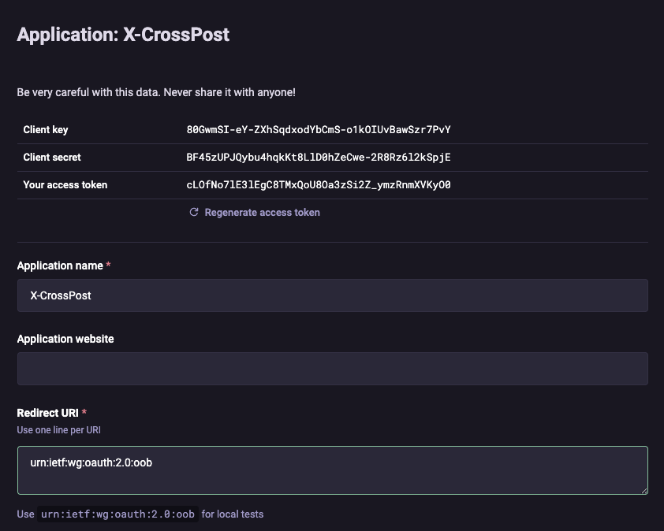
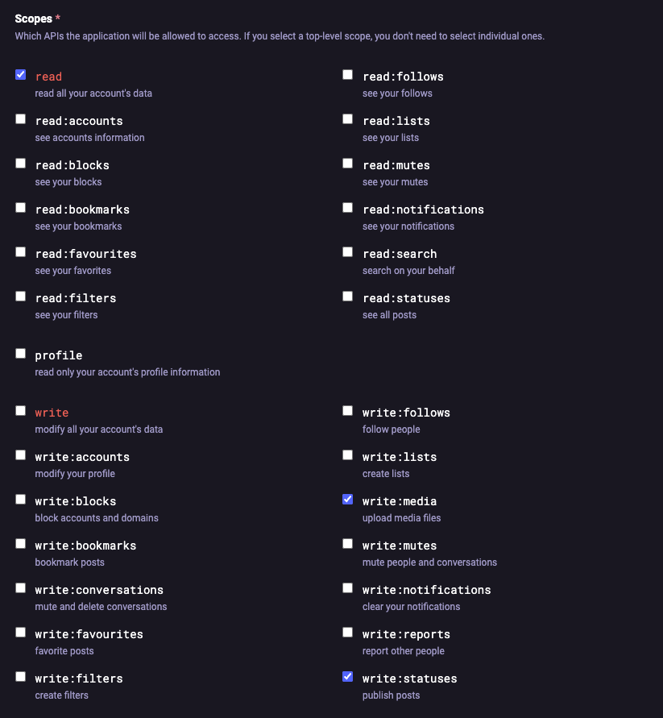
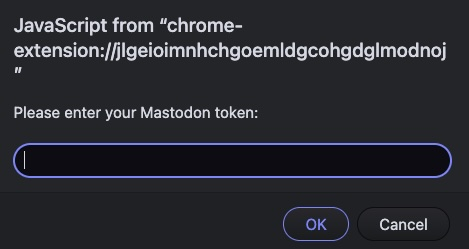
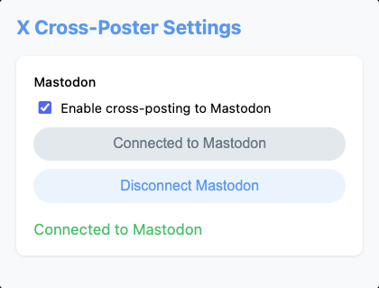

X-CrossPost is a Chrome extension that allows you to cross-post your X content to Mastodon.

## Features
- Cross-post to Mastodon with a single click.
- Toggle cross-posting on or off for Mastodon.
- Securely store your Mastodon API token.

## Chrome Store Installation
1. Download the extension through https://chromewebstore.google.com/detail/jlgeioimnhchgoemldgcohgdglmodnoj

## Manual Installation
1. Download or clone this repository.
2. Open **Google Chrome** and navigate to `chrome://extensions/`.
3. Enable **Developer mode** (toggle switch in the top-right corner).
4. Click **"Load unpacked"** and select the project folder.

## Setting Up Mastodon
To connect Mastodon, you need to create an **application** on your Mastodon instance and obtain an API token.
### Steps to Get Your Mastodon API Token:
1. **Log in to your Mastodon account.**
2. Navigate to **Preferences → Development**.
3. Click **New Application**.
4. Fill in the application details:
   - **Application name**: `X-CrossPost`
   - **Redirect URI**: We don't need to use redirect URI so just copy paste Mastodon's suggestion for local tests urn:ietf:wg:oauth:2.0:oob.
   - **Scopes**:
     - ✅ `write:statuses`
     - ✅ `write:media`
     - ✅ `read:accounts`
5. Click **Save Application**.
6. Copy the **Access Token** from the newly created application.
7. Open the **X-CrossPost** extension popup and paste the token into the provided input field when you click the **Connect to Mastodon** button.
8. Don't share your token with anyone as this will mean someone could post on your mastodon account. If you don't want to use the extension anymore I would advise you to just delete the mastodon application.

### Example of Mastodon Application settings:

### And the necessary Scopes:

## Usage
1. Open the extension popup by clicking on the **X-CrossPost** icon in the Chrome toolbar.
2. Toggle **"Enable cross-posting to Mastodon"** if not already enabled.
4. Click **"Connect Mastodon Account"**.
5. Insert your access token on the popup input field and press OK. 
6. Whenever you post on X, X-CrossPost will automatically cross-post to Mastodon.

## The extension should look like this:

## Disconnecting Mastodon
- To disconnect, open the popup and click **"Disconnect Mastodon"**.
- This will remove your saved API token.

## Known issues!!

1. Right now you can cross-post text and images content only. So for example if you just write a text tweet it will work, if you write a text and image tweet it will also work however, if you try to upload a video it won't work. I need to add more types of media but don't have a lot of time so if you want to contribute please let me know or just create a pull request and I will have a look!

## Contributing
Feel free to contribute by submitting issues or pull requests.

## Support
If you would like to give me a donation to help supporting my work feel free to donate here https://buymeacoffee.com/offroad thank you very much!